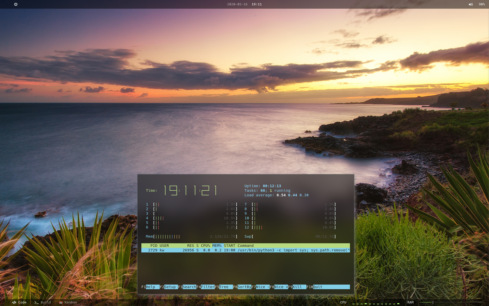
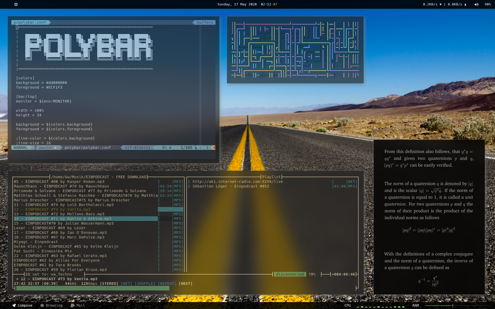

# `.`-Files

Each sub-folder contains configurations for important applications. They can be
installed separately or combined using installation scripts provided
`install.arch.sh` or `install.debian.sh` in the respective folder scope. These
install scripts should install all required dependencies, packages and setup
the symlinks.

## Screens

## Featured Installations and Configurations

- **OS**: `Manjaro`/`Arch` Linux (some for `Ubuntu` and `MacOS`)
- **WM**: `i3`
- **Bar**: `polybar`
- **Terminal**: `KiTTY`
- **Drop down terminal**: `tilda`
- **Shell**: `zsh`
- **Editor**: `Neovim`
- **Terminal font**: Hack
- **Polybar font**: Hack and Font Awesome
- **Notification**: `dunst`
- **Compositor**: `compton-tryone`
- **Browser**: Firefox Nightly
- **Music player**: `mocp`
- **Menu**: `rofi`
- **PDF**: `zathura`
- **Version control**: `git`
- **Lockscreen**: `betterlockscreen`
- **GTK L&F**
  - Widget: Matcha-dark-azul
  - Icons: Papirus-Dark
  - Cursor: Bibata Ice
  - Font: Noto Sans 10pt
- **Default apps association**: `mimeo`

## Open Points

- Polybar
  - add wifi, vpn, battery temperature to top polybar
- Installation
  - create remaining easy install scripts
- walls
  - create easy 500px pull random image from category script
